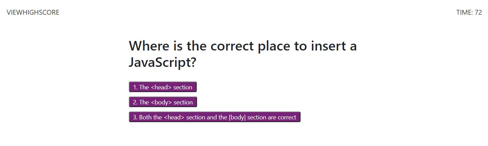

# code-quiz

## Description
This project can be used for checking general JavaScript knowledge for Developers. There are total 4 questions and the quiz should be finished in 75 seconds. For wrong answer, timer decreases 5 seconds. After finishing the quiz, remaining time will be final score. Save the score and check the highscores or retake the quiz. The questions can be added if needed. Enjoy the quiz game!

## Table of Contents
* [URLs](#URLs)
* [Usage](#usage)
* [License](#license)

## URLs
1. Deployed URL
    https://songhee95.github.io/code-quiz/

2. Github Page URL
    [Github](https://github.com/Songhee95/code-quiz)

## Usage

## License
*MIT License*
Copyright (c) [2020] [SongheeYim]

Permission is hereby granted, free of charge, to any person obtaining a copy
of this software and associated documentation files (the "Software"), to deal
in the Software without restriction, including without limitation the rights
to use, copy, modify, merge, publish, distribute, sublicense, and/or sell
copies of the Software, and to permit persons to whom the Software is
furnished to do so, subject to the following conditions:

The above copyright notice and this permission notice shall be included in all
copies or substantial portions of the Software.

THE SOFTWARE IS PROVIDED "AS IS", WITHOUT WARRANTY OF ANY KIND, EXPRESS OR
IMPLIED, INCLUDING BUT NOT LIMITED TO THE WARRANTIES OF MERCHANTABILITY,
FITNESS FOR A PARTICULAR PURPOSE AND NONINFRINGEMENT. IN NO EVENT SHALL THE
AUTHORS OR COPYRIGHT HOLDERS BE LIABLE FOR ANY CLAIM, DAMAGES OR OTHER
LIABILITY, WHETHER IN AN ACTION OF CONTRACT, TORT OR OTHERWISE, ARISING FROM,
OUT OF OR IN CONNECTION WITH THE SOFTWARE OR THE USE OR OTHER DEALINGS IN THE
SOFTWARE.
